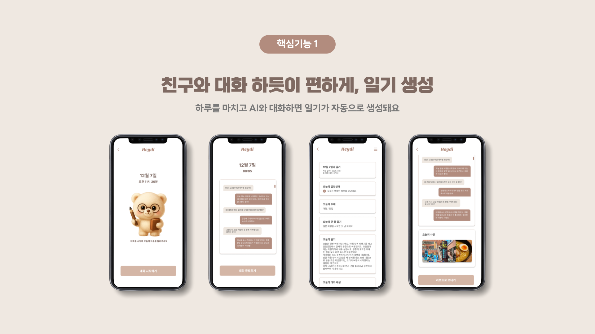
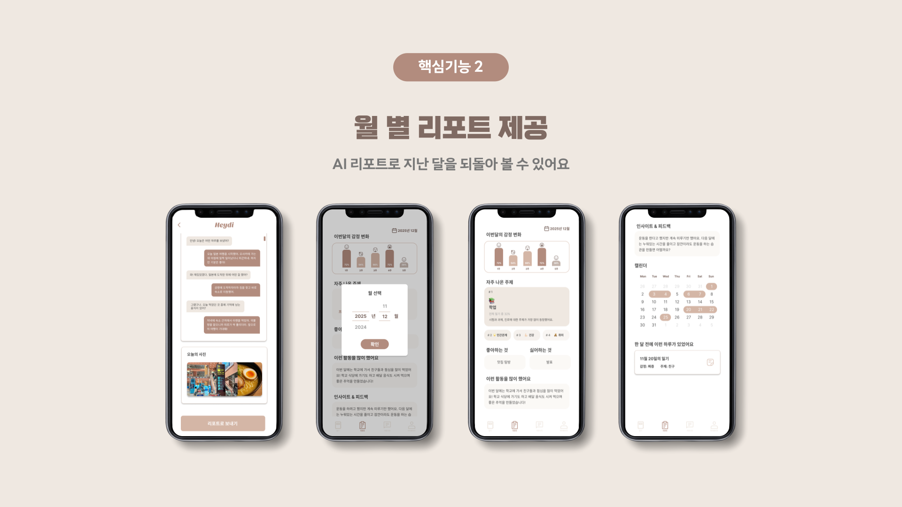
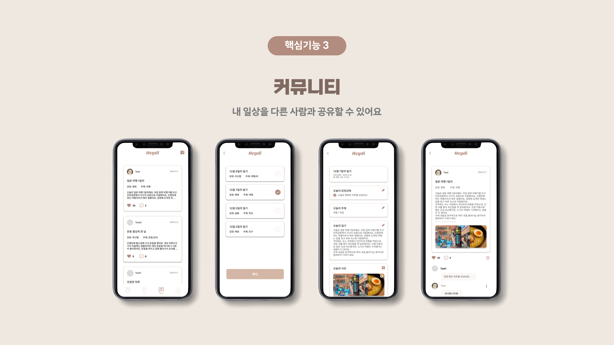
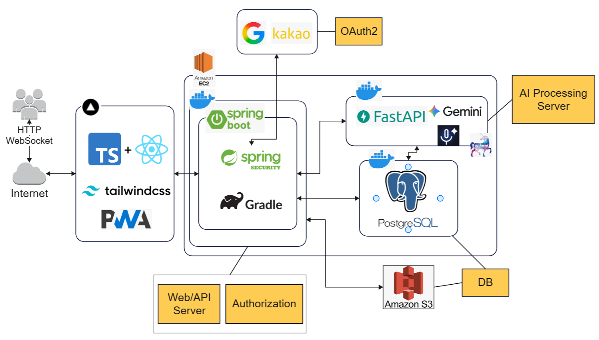
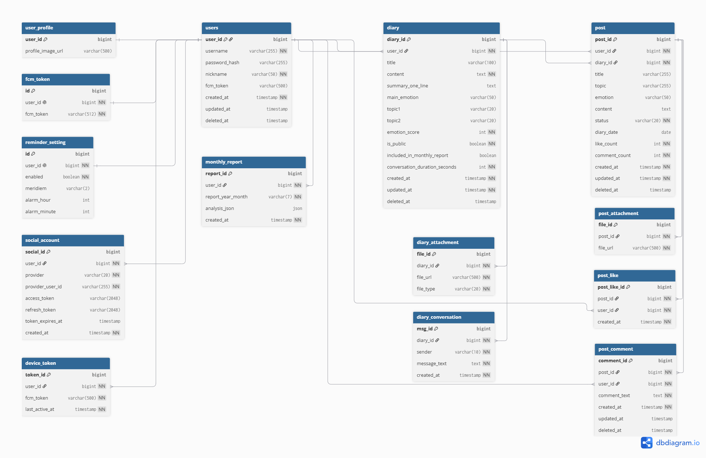

# 📓 [Heydi](https://heydi.site/)

> **대화로 정리하는 나만의 일기, 헤이디**

Heydi와 함께 번거로운 작성 없이, AI와의 대화로 일기를 완성하세요!

---

## ✍️ 프로젝트 개요

- **프로젝트명:** Heydi (헤이디)
- **프로젝트 기간:** 2025.9 ~ 2026.6
- **프로젝트 형태:** 가천대학교 소프트웨어 졸업작품 프로젝트
- **목표:** 생성형 AI와 음성 인터페이스를 활용하여 사용자가 자연스럽게 하루를 기록하고 감정을 돌아볼 수 있는 AI 기반 음성 일기 서비스를 개발
- **주요 타겟 사용자:** AI와의 자연스러운 대화를 통해 하루를 정리하고 자기 성찰을 원하는 사용자

---

## ✨ 프로젝트 소개

일기를 쓰는 일은 나를 돌아보는 가장 좋은 방법이지만, 매일 글로 정리하는 일은 쉽지 않습니다.

**Heydi**는 사용자가 하루를 **말로 이야기하면**,
AI가 실시간 음성 대화를 통해 공감하고 질문하며  
그날의 감정과 이야기를 **자연스러운 일기**로 정리해주는 **AI 음성 대화 기반 일기 서비스**로,

- 키보드 없이 **AI와 음성으로 대화하며 하루를 기록**,
- 작성된 일기를 통해 나의 **하루를 객관적으로 이해**,
- 일기를 **커뮤니티에 공유**하며 다른 사람들의 하루에 공감,
- 쌓인 기록을 바탕으로 **월간 리포트**를 통해 나의 변화를 확인할 수 있습니다. 

---

## 🐥 서비스 미리보기

  

  

  

  

---

## 🚀 주요 기능

- 🎙️ **AI 음성 대화 기반 일기 작성**
  Gemini Live API를 활용해 AI와 음성으로 대화하며 하루를 기록하고 정리

- 📝 **자동 일기 생성**
  대화 내용을 바탕으로 감정과 주제를 분석해 AI 일기 자동 작성

- 📅 **일기 기록 관리**
  날짜별 일기 조회, 사진 추가 및 일기 수정·삭제 관리

- 📄 **일기 내보내기**
  작성한 일기를 PDF로 저장하고 보관

- 📊 **월간 리포트 생성**
  감정 변화 / 자주 등장한 주제 / 자주 한 활동 / 인사이트 확인

- 🌱 **커뮤니티**
  선택한 일기를 공유하고 좋아요와 댓글로 공감

- 🔔 **FCM 알림**
  일기 작성을 잊지 않도록 리마인더 알림 제공

- 👤 **마이페이지**
  나의 기록 히스토리 및 개인 설정 관리

---

## 🧑‍💻 팀원 소개

<table>
  <tr>
    <td align="center">
      <a href="https://github.com/nyewon" target="_blank">
        
         
        <strong>노예원</strong>
      </a>
      

      팀장 · Frontend · Design
    </td>
    <td align="center">
      <a href="https://github.com/gooozooo" target="_blank">
        
         
        <strong>남지원</strong>
      </a>
      

      Backend
    </td>
    <td align="center">
      <a href="https://github.com/anbj1004" target="_blank">
        
         
        <strong>안병준</strong>
      </a>
      

      AI · Backend
       
    </td>
    <td align="center">
      <a href="https://github.com/yun10292" target="_blank">
        
         
        <strong>안지윤</strong>
      </a>
      

      Backend
       
    </td>
  </tr>
</table>

---

## 🛠️ 기술 스택

### Frontend

### Backend

### AI

---

## 🌍 시스템 아키텍처

  

---

## 🚪 데이터베이스 설계 (ERD)

  

---

## 👀 Team Docs

  
  

